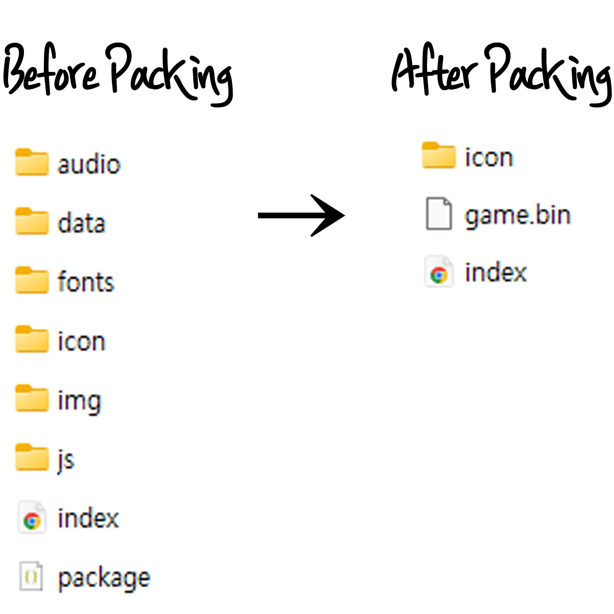

# Churitoring_SecuPacker

<a href="https://github.com/Churitoring/SecuPacker">English</a> | <a href="README_KO.md">한국어</a> | <a href="README_JA.md">日本語</a> | <b>Deutsch</b> | <a href="README_ES.md">Español</a> | <a href="README_FR.md">Français</a> | <a href="README_IT.md">Italiano</a> | <a href="README_PT.md">Português</a> | <a href="README_RU.md">Русский</a> | <a href="README_ZH.md">简体中文</a> | <a href="README_ZH_TW.md">繁體中文</a> | <a href="README_PL.md">Polski</a>

<a href="https://github.com/Churitoring/SecuPacker/releases/latest/download/Churitoring_SecuPacker.js">
  
</a>

Ein Ressourcen-Sicherheits-Pack-Plugin für RPG Maker MV / MZ.

> **Nur für Windows.** Funktioniert nicht unter macOS oder Linux.

---

## Inhaltsverzeichnis


1. [Verwendung](#1-verwendung)
2. [Systemanforderungen](#2-systemanforderungen)
3. [Parameter-Referenz](#3-parameter-referenz)
   - [3-1. Allgemeine Pack-Einstellungen](#3-1-allgemeine-pack-einstellungen)
   - [3-2. Datei-Pack-Einstellungen](#3-2-datei-pack-einstellungen)
   - [3-3. Sicherheitseinstellungen](#3-3-sicherheitseinstellungen)
   - [3-4. Zusätzliche Einstellungen](#3-4-zusätzliche-einstellungen)
   - [3-5. Auto-Update für Spieler](#3-5-auto-update-für-spieler)
4. [JavaScript-API](#4-javascript-api)
5. [Plugin-Befehle](#5-plugin-befehle)
6. [Hinweise](#6-hinweise)

---

## 1. Verwendung

Der grundlegende Pack-Ablauf ist wie folgt.

**Schritt 1 — Plugin installieren**

Legen Sie `Churitoring_SecuPacker.js` in den Ordner `js/plugins/` Ihres Projekts und aktivieren Sie es im RPG-Maker-Plugin-Manager. Konfigurieren Sie die Parameter in diesem Schritt nach Ihren Wünschen.

**Schritt 2 — Deployment-Ordner erstellen**

Öffnen Sie im RPG Maker **Datei > Deployment** und deployen Sie für die **Windows**-Plattform.

**Schritt 3 — Packen ausführen**

Starten Sie die `.exe` des Spiels im deploynten Ordner. Ein Pack-Fortschrittsbildschirm erscheint automatisch. Schließen Sie das Fenster während dieses Vorgangs nicht. Auch wenn Sie zwischendurch abbrechen, wird das Spiel beim nächsten Start wahrscheinlich automatisch wiederhergestellt – aber es ist besser zu warten.

**Schritt 4 — Veröffentlichen**

Nach Abschluss des Packens startet das Spiel automatisch neu. Sie können diesen Deployment-Ordner direkt an Ihre Spieler weitergeben.

Hinweis: Wenn `Player Auto Update` auf `true` gesetzt ist, wird das Spiel nach einem Bestätigungsdialog beendet (anstatt neu zu starten). Starten Sie das Spiel an diesem Punkt nicht neu – andernfalls wird ein Update auf die alte Version versucht. Laden Sie stattdessen zuerst die gepackten Dateien auf GitHub Releases hoch.

---

## 2. Systemanforderungen

- RPG Maker MV 1.6.0 oder höher, oder RPG Maker MZ 1.0.0 oder höher
- NW.js 0.28.1 oder höher (empfohlen: 0.44.3 oder höher)

---

## 3. Parameter-Referenz

### 3-1. Allgemeine Pack-Einstellungen

**Packer Auto-Update**

Vor Beginn des Packens ruft das Plugin die neueste Version von GitHub ab und überschreibt `js/plugins/Churitoring_SecuPacker.js`. Wenn Sie diese Datei direkt modifiziert haben, müssen Sie dies auf `false` setzen – andernfalls werden Ihre Änderungen bei jedem Packvorgang rückgängig gemacht. Wenn Sie das Plugin ohne Modifikationen verwenden, lassen Sie es auf `true`.

**Spiel-Binärname**

Der Dateiname für die gepackte Ausgabedatei. Standard ist `game.bin`, aber Sie können ihn hier ändern. Es wird nur der Dateiname akzeptiert – Pfade sind nicht erlaubt. Es wird empfohlen, einen weniger vorhersehbaren Namen zu wählen. Die Dateiendung kann ebenfalls geändert werden.

**Laufzeit-Schreiben erfassen**

Während des Testspielens werden die Pfade von Dateien, die von anderen Plugins erstellt oder geändert werden, in `data/SecuPacker_RuntimeWrites.txt` aufgezeichnet. Beim Packen werden diese Dateien nicht ins Paket aufgenommen, sondern auf der Festplatte belassen.

Wenn Sie Plugins verwenden, die automatisch Dateien wie Konfigurationsdateien generieren, aktivieren Sie diese Option. Es wird empfohlen, den Standardwert `true` beizubehalten, sofern kein besonderer Grund vorliegt.

Hinweis: Durch diese Option verfolgte Dateien sind vom Spieler-Auto-Update und dem Schutz von SecuPacker ausgeschlossen.

**Schreibschutz entfernen**

In der abschließenden Bereinigungsphase des Packens werden die ursprünglichen Ressourcendateien gelöscht. Wenn Dateien das Schreibschutz-Attribut (R) gesetzt haben, schlägt die Löschung fehl. Wenn Sie Ihr Projekt mit Git verwalten oder Tools verwenden, die Dateien automatisch als schreibgeschützt markieren, führt die Einstellung `true` dazu, dass vor dem Löschen `attrib -R` ausgeführt wird. Es wird empfohlen, den Standardwert `true` beizubehalten, sofern kein besonderer Grund vorliegt.

---

### 3-2. Datei-Pack-Einstellungen

**Dateiaufteilung**

Anstatt alle Ressourcen in eine einzige Datei zu packen, können Ressourcen auf mehrere Paketdateien verteilt werden. Nützlich zum Trennen von DLC-Ressourcen vom Basisspiel oder zum Aufteilen großer Projekte. Wenn auf `false` gesetzt, werden auch alle Einträge der Dateiaufteilungs-Liste ignoriert.

**Dateiaufteilungs-Liste**

Definiert Regeln, welche Dateien/Ordner in welche Paketdatei kommen. Jeder Eintrag hat zwei Einstellungen:

- **Fragment-Bin-Datei**: Der Dateiname für diese Gruppe von Dateien. Muss sich vom Hauptpaket-Dateinamen unter Spiel-Binärname unterscheiden. Beispiel: `dlc.bin`, `bgm.bin`
- **Fragment-Pfadmuster**: Eine Liste von Pfaden, die in diese Datei aufgenommen werden sollen. Die Angabe eines Ordners wie `audio/bgm` schließt rekursiv alle darin enthaltenen Dateien ein. Sie können auch eine einzelne Datei angeben, z. B. `audio/se/boss.ogg`.

**Pack-Ausnahmen**

Gibt Dateien oder Ordner an, die vom Packen ausgeschlossen und auf der Festplatte belassen werden sollen. Pfade sind relativ zum Projektstamm und müssen Schrägstriche (`/`) verwenden. Beispiel: `img/system/Loading.png`, `audio/bgm`

Fügen Sie hier alle Dateien hinzu, die zur Laufzeit direkt von der Festplatte gelesen werden müssen. Dateien in dieser Liste werden vom Packen ausgeschlossen und nicht gelöscht.

Hinweis: Dateien in dieser Liste sind vom Spieler-Auto-Update und dem Schutz von SecuPacker ausgeschlossen.

---

### 3-3. Sicherheitseinstellungen

**Startparameter-Whitelist**

Wenn beim Start ein URL-Query-String oder NW.js-Startparameter erkannt wird, der nicht in dieser Liste steht, wird das Spiel sofort beendet. Standard ist eine leere Liste, d. h. alle externen Parameter werden standardmäßig blockiert. Fügen Sie alle Parameter hinzu, die erlaubt sein sollen.

Diese Prüfung gilt nur für gepackte Verteilungs-Builds und nicht für Test-Spieldurchläufe während der Entwicklung.

**Frühe Blob-Auflösung**

Verschiebt den Zeitpunkt, zu dem Dateipfade in Blob-URLs (innerhalb der gepackten Datei) umgewandelt werden, auf die `Bitmap.load`-Ebene vor. In den meisten Fällen sollte dies auf `true` belassen werden.

Wenn Sie jedoch ein Plugin verwenden, das `fs.readFile` oder `XMLHttpRequest` direkt abfängt, um eigene Entschlüsselung zu verarbeiten, setzen Sie dies bei Konflikten auf `false`.

Das Setzen auf `false` kann die Kompatibilität verringern.

**Cheat-Erkennung aktivieren**

Scannt regelmäßig nach Hacking-Tools, die als Hintergrundprozesse laufen.

**Ausgeschlossene Binär-Hashes**

Die Namen (oder Teilnamen) von Binärdateien, die beim Berechnen des Umgebungs-Fingerabdruck-Hashes ausgeschlossen werden sollen.

Der Grund, warum `ffmpeg` standardmäßig enthalten ist, liegt an der FFmpeg-Lizenz (LGPL). Die LGPL verlangt, dass Benutzer die Binärdatei durch ihre eigene ersetzen können. Würde FFmpeg in den Hash einbezogen, würde sich der Hash beim Ersetzen ändern und das Spiel könnte nicht mehr starten – daher ist es zur Lizenzkonformität standardmäßig ausgeschlossen.

Lassen Sie den Standardwert unverändert, sofern kein besonderer Grund vorliegt.

Beispiel: `ffmpeg.dll` (nur ffmpeg.dll ausschließen)  
Beispiel: `ffmpeg` (sowohl ffmpeg.dll als auch ffmpegsumo.dll ausschließen)

**Exe-Dateien hashen**

Wenn auf `true` gesetzt, wird auch die `.exe`-Datei des Spiels in den Umgebungs-Fingerabdruck-Hash einbezogen. Dies verhindert, dass die gepackte Datei mit einer anderen `.exe` verwendet werden kann. Wichtig: Alle Änderungen an der `.exe` – wie das Ersetzen des Symbols oder das Ändern des Manifests – müssen **vor** dem Packen abgeschlossen sein. Änderungen an der `.exe` nach dem Packen ändern den Hash und verhindern das Starten des Spiels.

---

### 3-4. Zusätzliche Einstellungen

**Fenstergröße sperren**

Wenn auf `true` gesetzt, können Spieler die Größe des Spielfensters nicht ändern oder es maximieren. Der Maximieren-Button verschwindet möglicherweise oder hört auf zu funktionieren.

**F2 / F4 / F5-Taste sperren**

Blockiert jeweils die Framerate-Anzeige (F2), den Vollbildmodus-Wechsel (F4) und das Spielneustart (F5). Aktivieren Sie diese Optionen, wenn Sie nicht möchten, dass Spieler diese Funktionen in einem Verteilungs-Build nutzen.

---

### 3-5. Auto-Update für Spieler

**Spieler Auto-Update**

Wenn auf `true` gesetzt, kommuniziert das Spiel beim Start mit dem GitHub-Release-Server. Wenn eine neue Version der gepackten Datei verfügbar ist, wird diese automatisch heruntergeladen und ersetzt. Um diese Funktion zu nutzen, muss auch die `Auto-Update-URL` unten konfiguriert werden.

Wenn auf `true` gesetzt, wird das Spiel nach Abschluss des Packens beendet (anstatt neu zu starten). Starten Sie das Spiel an diesem Punkt nicht neu – andernfalls wird ein Update auf die alte Version versucht. Laden Sie stattdessen die gepackten Dateien zuerst auf GitHub Releases hoch.

Wenn Sie testen müssen, ob das Packen erfolgreich war, setzen Sie dies vor dem Testen auf `false`.

**Auto-Update-URL**

Die GitHub-Repository-URL, von der Updates abgerufen werden. Geben Sie sie im Format `https://github.com/Benutzername/Repository` ein. Private Repositories werden nicht unterstützt.

Beispiel: `https://github.com/Churitoring/SecuPacker`

**Auto-Update-Tag**

Wenn leer gelassen, wird immer vom neuesten Release aktualisiert.

Bei Angabe eines Tags wird vom neuesten Release mit diesem Tag aktualisiert. Es wird empfohlen, ein einzelnes Repository zu erstellen und spielspezifische Tags zu Releases hinzuzufügen – so kann die Player-Auto-Update-Funktion von SecuPacker für mehrere Spiele mit einem einzigen Repository verwaltet werden.

Beispiel: `SecuPacker`

**Ohne Internet deaktivieren / Bei Update-Fehler deaktivieren**

Konfiguriert das Verhalten, wenn keine Internetverbindung besteht oder der Update-Server nicht erreichbar ist.

Wenn das Spiel nur bei fehlender Internetverbindung beendet werden soll, die Update-Funktion aber nicht genutzt werden soll, wird empfohlen: `Spieler Auto-Update` auf `true`, `Auto-Update-URL` leer, `Ohne Internet deaktivieren` auf `true` und `Bei Update-Fehler deaktivieren` auf `false` zu setzen.

- `Ohne Internet deaktivieren` auf `true` zeigt eine Warnung an und beendet das Spiel, wenn keine Internetverbindung besteht.
- `Bei Update-Fehler deaktivieren` auf `true` beendet das Spiel auch, wenn der Server erreichbar ist, aber die Datei nicht abgerufen werden kann.

**Update-Bildschirm-Einstellungen (PAU Scene \*)**

Konfiguriert die Benutzeroberfläche, die während des automatischen Update-Prozesses angezeigt wird.

*Text*

- **PAU Scene Update Text**: Text, der im Titelbereich während des Downloads angezeigt wird. Standard: `Updating...`
- **PAU Scene Complete Text**: Text, der im Titelbereich angezeigt wird, wenn das Update erfolgreich abgeschlossen wurde. Standard: `Update complete!`
- **PAU Scene Failed Text**: Text, der im Titelbereich angezeigt wird, wenn das Update fehlschlägt. Standard: `Update failed`

*Animation*

- **PAU Scene Blink**: Wendet eine pulsierende Deckkraft-Animation auf den Titeltext an. Standard: `true`
- **PAU Scene Blink Speed**: Geschwindigkeit des Blinkzyklus. Höhere Werte = schneller. Bei `0.050` etwa ein Zyklus pro 2 Sekunden bei 60fps. Bereich: `0.001` ~ `1.000`. Standard: `0.050`

*Fortschritt*

- **PAU Scene Show Progress**: Zeigt Download-Fortschritt (%) und Dateigröße (KB) im Untertextbereich während der Aktualisierung an. Standard: `true`

*Hintergrund*

- **PAU Scene BG Type**: Wählt den Hintergrundtyp. `color` (Volltonfarbe) / `image` (Bild) / `video` (Video). Standard: `color`
- **PAU Scene BG Color**: CSS-Farbcode für den einfarbigen Hintergrund bei Typ `color`. Standard: `#000000`
- **PAU Scene BG Image**: Hintergrundbild-Datei bei Typ `image`. Aus dem `img/`-Ordner auswählen.
- **PAU Scene BG Video**: Videodateipfad bei Typ `video`. Als Zeichenkette eingeben. Beispiel: `movies/bg.webm`
- **PAU Scene BG Fit**: Wie Bild oder Video angepasst wird, wenn das Seitenverhältnis nicht mit dem Bildschirm übereinstimmt. `cover` (zuschneiden, Bildschirm füllen) / `contain` (Letterbox, Seitenverhältnis beibehalten) / `fill` (auf Bildschirm strecken). Standard: `cover`
- **PAU Scene Video Loop**: Wiederholt das Hintergrundvideo. Bei `false` stoppt es am letzten Frame. Standard: `true`
- **PAU Scene Video Volume**: Lautstärke des Hintergrundvideos. `0` (stumm) ~ `100`. Standard: `100`

*Hintergrundmusik*

- **PAU Scene BG Music**: Musikdatei für den Update-Bildschirm. Aus dem `audio/`-Ordner auswählen. Kann zusammen mit einem Videohintergrund verwendet werden.
- **PAU Scene BG Music Volume**: Lautstärke der Hintergrundmusik. `0` (stumm) ~ `100`. Standard: `80`
- **PAU Scene BG Music Loop**: Wiederholt die Hintergrundmusik. Bei `false` wird einmal abgespielt und gestoppt. Standard: `true`

*Titeltext-Stil*

- **PAU Scene Title X Offset**: Horizontaler Pixelversatz des Titeltexts von der Bildschirmmitte. `0` = zentriert. Standard: `0`
- **PAU Scene Title Y Offset**: Vertikaler Pixelversatz des Titeltexts von der Bildschirmmitte. Negative Werte verschieben ihn nach oben. Standard: `-30`
- **PAU Scene Title Size**: Schriftgröße des Titeltexts in Pixeln. Standard: `36`
- **PAU Scene Title Color**: Titeltextfarbe im CSS-Hex-Format. Standard: `#ffffff`
- **PAU Scene Title Outline Width**: Umrandungsbreite des Titeltexts in Pixeln. `0` = keine Umrandung. Standard: `0`
- **PAU Scene Title Outline Color**: Umrandungsfarbe des Titeltexts. Unterstützt CSS-Hex oder `rgba()`-Format. Standard: `rgba(0,0,0,0.5)`

*Untertext-Stil*

Der Untertext ist die sekundäre Zeile unterhalb des Titels, die Fortschritt oder Statusmeldungen anzeigt.

- **PAU Scene Sub X Offset**: Horizontaler Pixelversatz des Untertexts von der Bildschirmmitte. Standard: `0`
- **PAU Scene Sub Y Offset**: Vertikaler Pixelversatz des Untertexts von der Bildschirmmitte. Standard: `30`
- **PAU Scene Sub Size**: Schriftgröße des Untertexts in Pixeln. Standard: `18`
- **PAU Scene Sub Color**: Untertextfarbe im CSS-Hex-Format. Standard: `#888888`
- **PAU Scene Sub Outline Width**: Umrandungsbreite des Untertexts in Pixeln. `0` = keine Umrandung. Standard: `0`
- **PAU Scene Sub Outline Color**: Umrandungsfarbe des Untertexts. Unterstützt CSS-Hex oder `rgba()`-Format. Standard: `rgba(0,0,0,0.5)`

---

## 4. JavaScript-API

Diese APIs können direkt aus anderen Plugins oder Skriptaufrufen aufgerufen werden, als Alternative zu Plugin-Befehlen.

Das direkte Aufrufen der API schafft eine Abhängigkeit von SecuPacker. Um Nebeneffekte zu vermeiden, wenn das Plugin deaktiviert wird, überprüfen Sie immer die Existenz des Objekts vor dem Aufruf.

**`SecuPacker.getVersion()`**

Gibt den Versions-String von SecuPacker zurück.

```javascript
SecuPacker.getVersion();
```

**`SecuPacker.isPacked()`**

Gibt `true` zurück, wenn das Spiel im gepackten Modus läuft, sonst `false`. Gibt beim Testen während der Entwicklung immer `false` zurück – kann also verwendet werden, um das Verhalten je nach Build-Typ zu unterscheiden.

```javascript
if (SecuPacker.isPacked()) {
    // Code, der nur in Verteilungs-Builds ausgeführt wird
}
```

**`SecuPacker.isSplitAvailable(binName)`**

Gibt `true` zurück, wenn die angegebene aufgeteilte Paketdatei existiert und zugänglich ist. Nützlich zum Überprüfen, ob eine DLC-Datei installiert ist.

```javascript
SecuPacker.isSplitAvailable("dlc.bin"); // true oder false
```

**`SecuPacker.isPlayerAutoUpdateReady()`**

Gibt `true` zurück, wenn das Spieler-Auto-Update aktiviert und eine URL konfiguriert ist.

```javascript
SecuPacker.isPlayerAutoUpdateReady(); // true oder false
```

---

## 5. Plugin-Befehle

In MZ verfügbare Plugin-Befehle.

**GetVersion** — Speichert den Versions-String von SecuPacker in einer Spielvariablen.

**IsPacked** — Speichert `true`, wenn das Spiel gepackt ist, sonst `false`, in einer Spielvariablen. Verwenden Sie dies, um das Spielverhalten je nach Build-Typ zu unterscheiden.

**IsSplitAvailable** — Überprüft, ob die angegebene aufgeteilte Paketdatei existiert und zugänglich ist, und speichert das Ergebnis in einer Spielvariablen. Nützlich zum Überprüfen, ob eine DLC-Datei vorhanden ist.

**IsPlayerAutoUpdateReady** — Speichert `true` in einer Spielvariablen, wenn das Spieler-Auto-Update aktiviert und eine URL konfiguriert ist.

---

## 6. Hinweise

- **Projektdatei-Schutz**: Wenn eine `*.rpgproject`- oder `*.rmmzproject`-Datei im Deployment-Ordner gefunden wird, behandelt das Plugin ihn als Entwicklungsverzeichnis und bricht das Packen ab. Führen Sie den Packer immer im deploynten Ordner aus, nicht im Entwicklungsprojektordner.
- **Datenschutz-Warnung**: Absolute Sicherheit existiert nicht. Egal wie sicher ein System ist, jemand könnte es möglicherweise knacken – geben Sie daher niemals persönliche oder sensible Informationen wie IDs, Passwörter oder API-Keys in Ihre Spieldateien ein.
- **Urheberrechts-Hinweis**: Entfernen Sie nicht die `LICENSE.txt`-Datei im selben Verzeichnis wie die gepackte Datei. Die Verteilung ohne diese Datei kann eine Urheberrechtsverletzung darstellen.
- **Schwarzer Bildschirm nach dem Packen**: Wenn das Spiel vor dem Packen im Testlauf normal funktionierte, aber nach dem Packen mit einer Fehlermeldung auf einem schwarzen Bildschirm einfriert, wird dies typischerweise durch einen Fehler in einem in `index.html` (MV) oder `main.js` (MZ) registrierten Skript verursacht. Wenn Sie benutzerdefinierte Skripte hinzugefügt oder registrierte Skripte geändert haben, sind diese die wahrscheinlichsten Ursachen.
